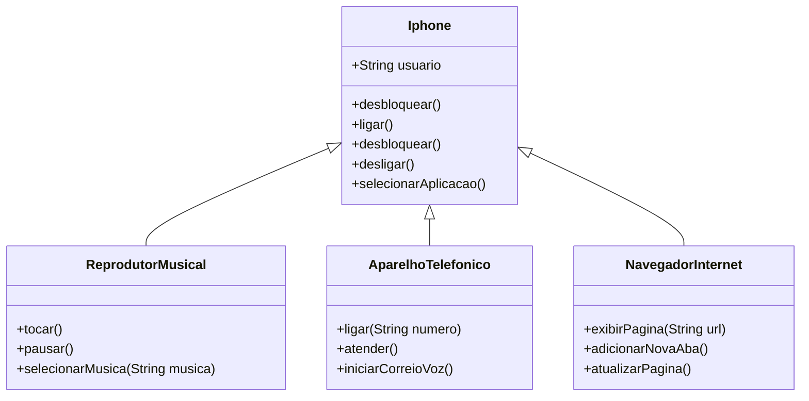

# DESAFIO DE PROJETO

## UML

```mermaid
classDiagram
    Iphone <|-- ReprodutorMusical
    Iphone <|-- AparelhoTelefonico
    Iphone <|-- NavegadorInternet
    Iphone : +String usuario
    Iphone : +desbloquear()
    Iphone : +ligar()
    Iphone : +desbloquear()
    Iphone : +desligar()
    Iphone : +selecionarAplicacao()

    class ReprodutorMusical{
      +tocar()
      +pausar()
      +selecionarMusica(String musica)
    }
    class AparelhoTelefonico{
      +ligar(String numero)
      +atender()
      +iniciarCorreioVoz()
    }
    class NavegadorInternet{
      +exibirPagina(String url)
      +adicionarNovaAba()
      +atualizarPagina()
    }
```